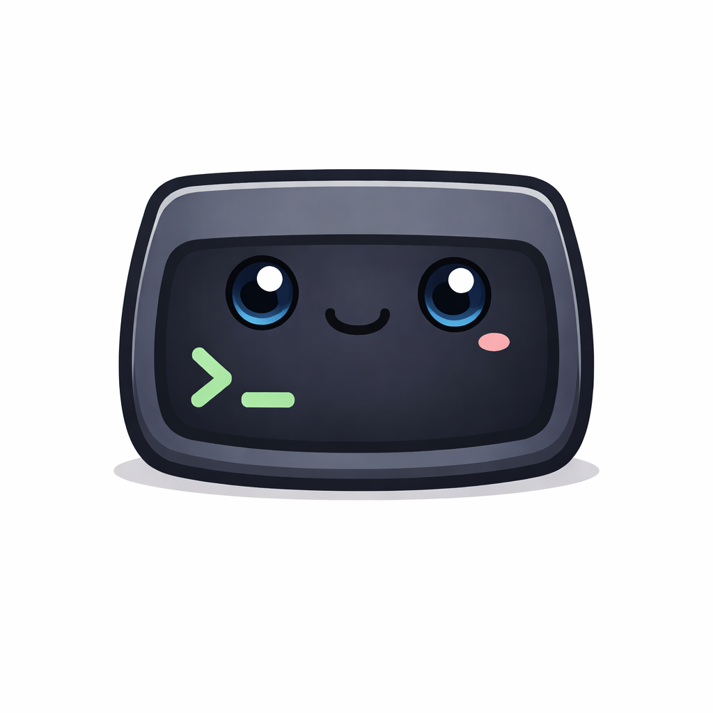

<div align="center">
  
  <h1>Termy</h1>
  <p>A minimal terminal emulator built with <a href="https://gpui.rs">GPUI</a> and <a href="https://alacritty.org">alacritty_terminal</a>.</p>
</div>

---

## Installation

### Homebrew (macOS, recommended)

```sh
brew tap lassejlv/termy https://github.com/lassejlv/termy
brew install --cask termy
```

### Build from source

> Requires Rust (stable). macOS is the primary supported platform; Windows support is experimental.

```sh
cargo run --release
```

## Configuration

Config file: `~/.config/termy/config.txt`

```txt
theme = termy
font_family = "JetBrains Mono"
font_size = 14
use_tabs = true
window_width = 1100
window_height = 720
keybind = cmd-p=toggle_command_palette
```

See [`docs/configuration.md`](docs/configuration.md) and [`docs/keybindings.md`](docs/keybindings.md) for the full reference.

## Building packages

| Platform | Command |
|----------|---------|
| macOS DMG | `./scripts/build-dmg.sh` |
| macOS signed DMG | `./scripts/build-dmg-signed.sh --sign-identity "..." --notary-profile TERMY_NOTARY` |
| Windows Setup.exe | `./scripts/build-setup.ps1 -Version 0.1.0 -Arch x64 -Target x86_64-pc-windows-msvc` |

## License

MIT — see [LICENSE](LICENSE).
