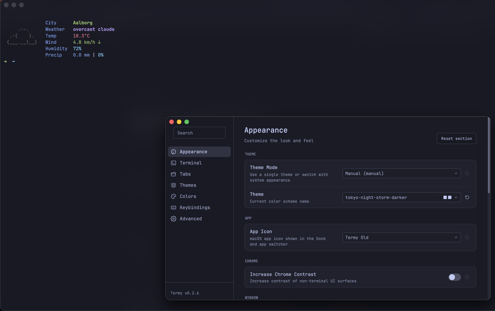

> Development of termy has been slowed down. Do to that i'm an student, i cannot afford to put that much effort into building termy at this point. Any support will be appriciated. I did not wish to come to this point. Love you all ❤️

# Termy

A fast, minimal terminal emulator built with [GPUI](https://gpui.rs) and [alacritty_terminal](https://alacritty.org).



[Docs](https://termy.sh/docs) · [Download](https://termy.sh/download) · [Contribute](CONTRIBUTING.md)

## Sponsors

Termy is supported by companies and people that care about fast, native developer tools.

<a href="https://neon.tech">
  <picture>
    <source media="(prefers-color-scheme: dark)" srcset="assets/legends/neon-logo-dark-color.svg">
    <source media="(prefers-color-scheme: light)" srcset="assets/legends/neon-logo-light-color.svg">
    
  </picture>
</a>
&nbsp;&nbsp;&nbsp;
<a href="https://github.com/mezotv">
  
</a>

## Features

- GPU-accelerated rendering with dirty-span cell caching
- Tabs, splits, and search
- Configurable keybinds and themes
- Tasks, layouts, and optional tmux sessions
- Native OS integrations on macOS

## Install

Prebuilt binaries: [termy.sh/download](https://termy.sh/download).

Build from source:

```bash
cargo run --release -p termy
```

## Configuration

Config and keybinds live under your platform config dir. See [docs/configuration.md](docs/configuration.md) and [docs/keybindings.md](docs/keybindings.md).

## Architecture

Termy is a Rust workspace with a GPUI desktop app, reusable headless runtime, CLI, FFI, website, and platform packaging scripts. See [Project Layout](docs/architecture/project-layout.md) for ownership boundaries and [Release Packaging](docs/architecture/release-packaging.md) for release artifact flow.

## Roadmap

- [Product & v1.0 plan](ROADMAP.md)
- [Engineering quality plan](docs/engineering/roadmap.md)

## Contributing

See [CONTRIBUTING.md](CONTRIBUTING.md) for setup, build, and validation commands.

## License

MIT. See [LICENSE](LICENSE).
